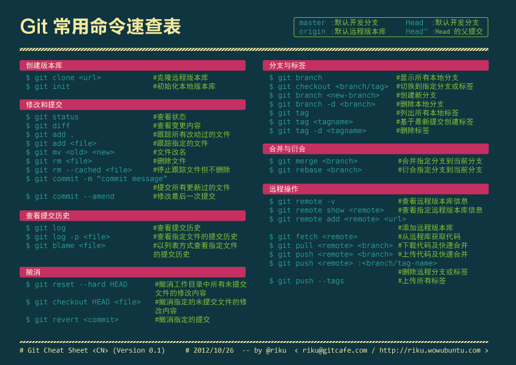

####Git命令

[git命令详解](http://blog.csdn.net/ithomer/article/details/7529022)    

#####1. 安装和配置

Install
	
	sudo apt-get install git-core
	git --version

**Setting** [参考地址](http://blog.csdn.net/alex_my/article/details/8741615)

1. 生成ssh-key `sudo ssh-keygen -t rsa -C "my first ssh-key"` [参考地址](http://blog.csdn.net/alex_my/article/details/8741625)    
2. 使用vi命令查看生成的ssh_key.pub内容并复制添加到Github上面的SSH Key里面    
3. 测试一下本地git跟github是否连接    
	
		ssh git@github.com 会提示输入密码，也就是生成的ssh_key的密码，整个过程如下：
	
		parallels@ubuntu:~$ ssh git@github.com
		The authenticity of host 'github.com (192.30.252.130)' can't be established.
		RSA key fingerprint is 16:27:ac:a5:76:28:2d:36:63:1b:56:4d:eb:df:a6:48.
		Are you sure you want to continue connecting (yes/no)? yes
		Warning: Permanently added 'github.com,192.30.252.130' (RSA) to the list of known hosts.
		PTY allocation request failed on channel 0
		Hi liujb! You've successfully authenticated, but GitHub does not provide shell access.
		Connection to github.com closed.
			
#####2. Create a new repository on the command line

    touch README.md
    git init
    git add README.md
    git commit -m "first commit"
    git remote add origin git@github.com:liujb/c-study.git
    git push -u origin master
    
#####3. Push an existing repository from the command line

    git remote add origin git@github.com:liujb/c-study.git
    git push -u origin master
    

#####4. Basic command

1. `git clone git@github.com:liujb/didi-fe.git`
2. `git status`
3. `git add file`
4. `git rm file`
5. `git commit file -m "These is comment"`
6. `git pull origin master`
6. `git push origin master`
7. `git branch f-test-branch master` -- 从master分支创建分支
8. `git checkout f-test-branch` -- 切换到f-test-branch分支
8. `git branch` -- 查看分支 
7. `git checkout -b f-test-branch master` -- 创建分支并切换到新创建的f-test-branch分支
8. `git branch -d f-test-branch` -- 删除分支
9. `git merge --no-ff master` -- 向前合并分支到主干
10. git分支管理

	- 主分支 
	- 主开发分支   
	- 临时性分支   
		
		- 功能(feature)分支
		- 预发布(release)分支
		- 修补BUG(fixbug)分支
		
11. `git tag -a 0.1.1` -- 创建tag
12. `git reset --hard HEAD ` -- revert
13. `git reset --hard ORIG_HEAD ` -- revert the commit files
14. `git fetch origin` -- fetch from server
15. `git reset --hard origin/master` --

#####5. OS X下git status中文会显示为编码的解决方案

    git config --global core.quotepath false

#####6. git命令简图

