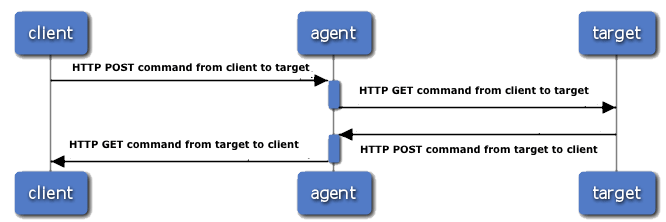
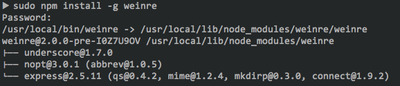
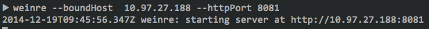
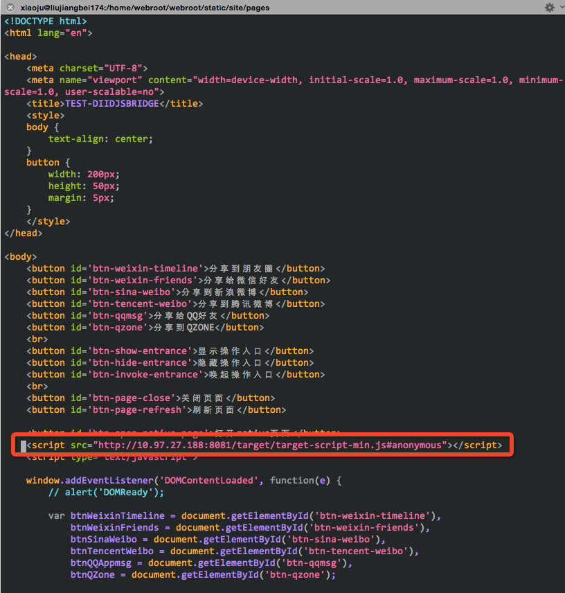
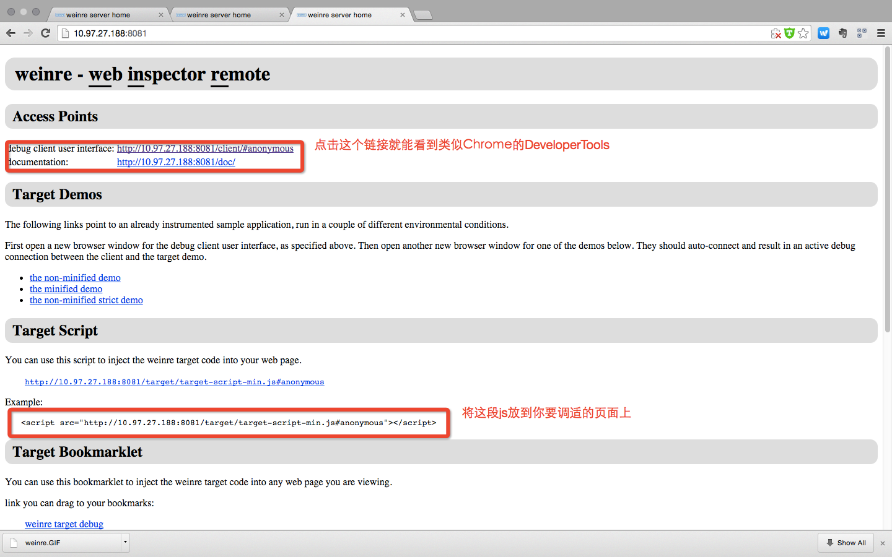
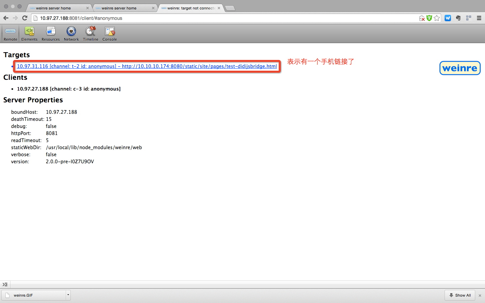
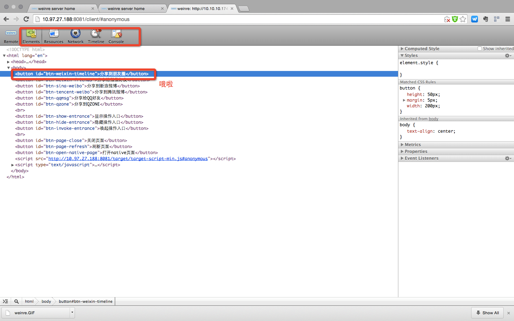
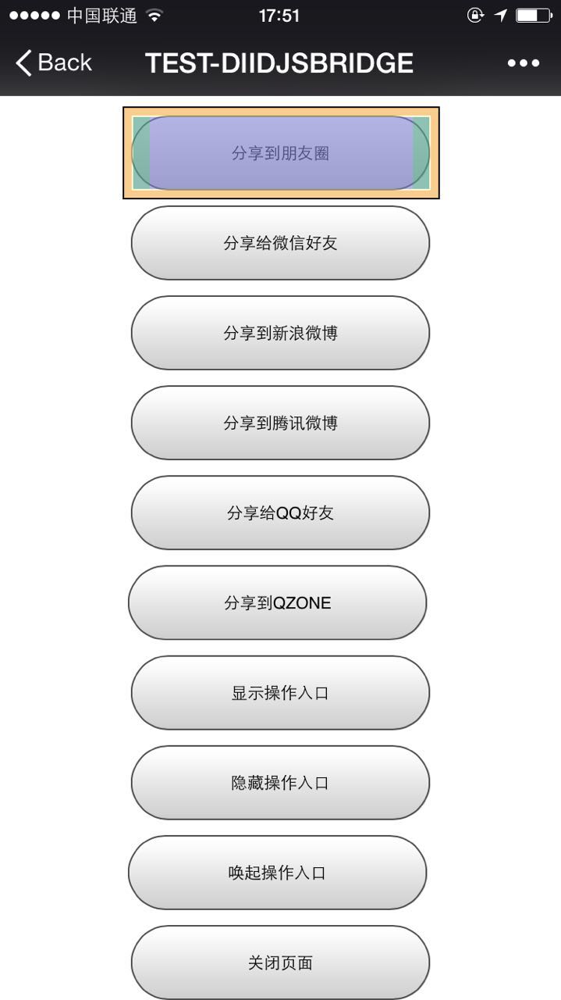

参考资料

[远程调试工具](http://wyqbailey.diandian.com/post/2011-11-09/20511143)
[官网文档](http://people.apache.org/~pmuellr/weinre/docs/latest/)

####前置条件

1. 如果你还没有`node`或者`java`环境，拜拜。（本文只演示在node环境下的）
2. `npm`也别问我是啥了，请Google之，也请别百度了。
3. 本文是在`OSX`下面进行的。`Windows`没有兼容问题。

####注意点

1. 手机和你的电脑必须在同一Wi-Fi。
2. 绑定的host是本机器（PC）的IP，而不是远程服务器。

#####Weinre的原理图

其实就是拿你的本机做了个代理，然后通过同步的方式来达到能互相通信。

####具体步骤如下

#####1. 全局环境下安装weinre `npm install -g weinre` 如图

#####2. 执行`weinre`命令，
注意这个默认会监听`localhost`的`8080`端口，所以请指定host和port，例如`weinre --boundHost 10.97.27.188 --httpPort 8081`.这个IP是你本机器的IP（跟你手机Wi-Fi在同一局域网的）不是远程服务器IP地址。*高级用法请参考`weinre -h`* 如图    

#####3. 然后将

``放到你要调适的页面中。 如图

#####4. 点击打开如图所示的链接

#####5. 打开后如图所示

#####6. 选中一个元素后

#####7. 用手机打开你的网页如下图

*Note By liujb*

