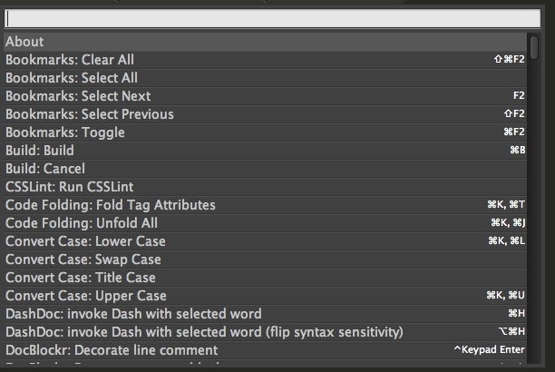
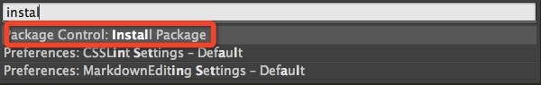
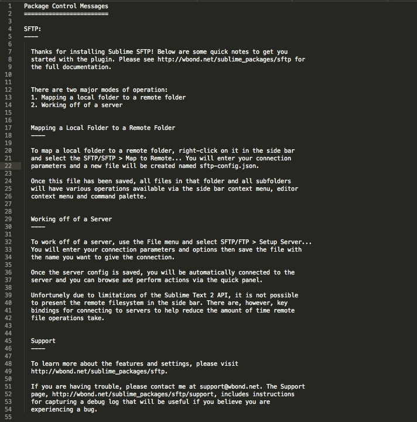
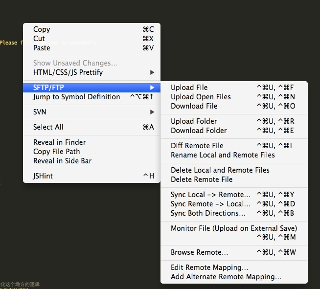

1. Ctrl+shift+P open your sublime-text package control

	

2. input `install package`

	

3. input `sftp` then install, when success like this

	

4. `sftp-config.json` in your project
	
		{
		    // The tab key will cycle through the settings when first created
		    // Visit http://wbond.net/sublime_packages/sftp/settings for help
		
		    // sftp, ftp or ftps
		    "type": "sftp",
		
		    "save_before_upload": true,
		    "upload_on_save": true,
		    "sync_down_on_open": false,
		    "sync_skip_deletes": false,
		    "sync_same_age": true,
		    "confirm_downloads": false,
		    "confirm_sync": false,
		    "confirm_overwrite_newer": false,
		
		    "host": "10.10.10.174",
		    "password": "liujiangbei",
		    "user": "xiaoju",
		    "port": "22",
		
		    "remote_path": "/home/webroot/webroot/static/webapp/src/",
		    "ignore_regexes": [
		        "\\.sublime-(project|workspace)", "sftp-config(-alt\\d?)?\\.json",
		        "sftp-settings\\.json", "/venv/", "\\.svn/", "\\.hg/", "\\.git/",
		        "\\.bzr", "_darcs", "CVS", "\\.DS_Store", "Thumbs\\.db", "desktop\\.ini"
		    ],
		    //"file_permissions": "664",
		    //"dir_permissions": "775",
		
		    //"extra_list_connections": 0,
		
		    "connect_timeout": 30,
		    //"keepalive": 120,
		    //"ftp_passive_mode": true,
		    //"ftp_obey_passive_host": false,
		    //"ssh_key_file": "~/.ssh/id_rsa",
		    //"sftp_flags": ["-F", "/path/to/ssh_config"],
		
		    //"preserve_modification_times": false,
		    //"remote_time_offset_in_hours": 0,
		    //"remote_encoding": "utf-8",
		    //"remote_locale": "C",
		    //"allow_config_upload": false,
		}
		
5. Right click your file, you will see like this. And do want you want!

	
	
*note by liujb*