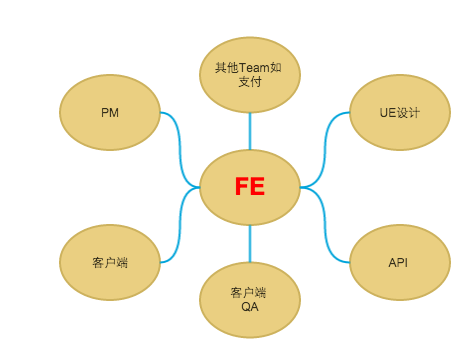

	一支富有激情和情怀的前端团队

#####简单 执着 追求极致。

	1. 简单 － 简单做人，极致做事。
	2. 执着 － 以一种坚韧的态度对待技术和产品，不轻易放弃。
	3. 追求极致 － 在完成功能的最初前提下，再进一步向极致靠近
	
#####团队要求

	1. 责任感 － 不解释！！！
	2. 主动性 － 团队中项目中明确自己的定位、特别是在遇到问题的时候、请以Owner心态面对everything！
	3. 项目推进 － 建立在第二条之上，请“想尽各种办法”推进你正在做的事情，确保如期进行。
	4. 时刻牢记提升自我，帮助别人。

#####落地要求

	1. 拒绝一切以完成任务为己任的心态。－ 不解释！！！
	2. 线上影响面大的问题无条件及时跟进。
	

#####角色

	1. UI细节必须跟UE同学达成一致不可擅自更改设计，但鼓励主动就交互细节跟UE沟通，
	在技术实现细节有问题时或者实现成本较大的前提下跟UE沟通达成共识方可更改。
	2. 产品功能不可擅自更改，但是鼓励跟PM主动沟通功能、交互，
	如有更改必须跟PM达成高度一致沟通后方可进行。
	3. 跟其他团队的沟通请以Owner心态面对一切。

	